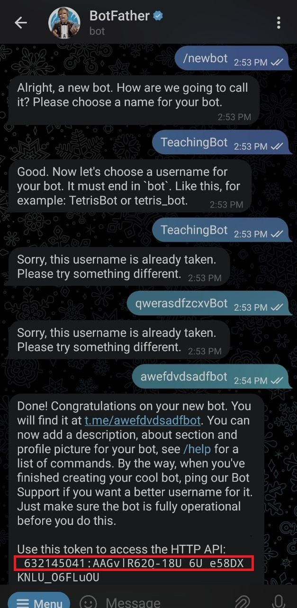

# KSTU

Creation date 09/26/2023<br>
The author is Nurdin Abdrasulov

Для создания бота, выполните следующие шаги:

* Перейдите по ссылке: https://t.me/BotFather.
* Вызовите команду /newbot.
* Задайте имя вашего бота.
* Задайте уникальное имя пользователя (username) для бота. Обратите внимание, что имя пользователя должно оканчиваться на "bot".


После завершения этих шагов, вы получите токен, который будет использоваться для управления вашим ботом.


# BotListener:
```
@Component
@RequiredArgsConstructor
@FieldDefaults(level = AccessLevel.PRIVATE, makeFinal = true)
@Slf4j
public class BotListener {
    TelegramBot bot;

    @Bean
    void updateListener() {
        bot.setUpdatesListener(updates -> {
            updates.forEach(update -> {
                Message message = update.message();
                if (message == null || !Objects.equals(message.chat().id(), message.from().id()))
                    return;

                Long chatId = message.chat().id();
                try {
                    var responseMessage = switch (message.text()){
                        case "/start" -> "Курс Java ИВТ";
                        case "/do" -> "Команда /do";
                        default -> "неизвестная команда";
                    };

                    SendResponse response = bot.execute(new SendMessage(chatId, responseMessage));
                    log.info(response.toString());

                } catch (RuntimeException e) {
                    log.error(e.getMessage(), e);
                    bot.execute(new SendMessage(chatId, e.getMessage()));
                }
            });
            return UpdatesListener.CONFIRMED_UPDATES_ALL;
        });
    }
}
```